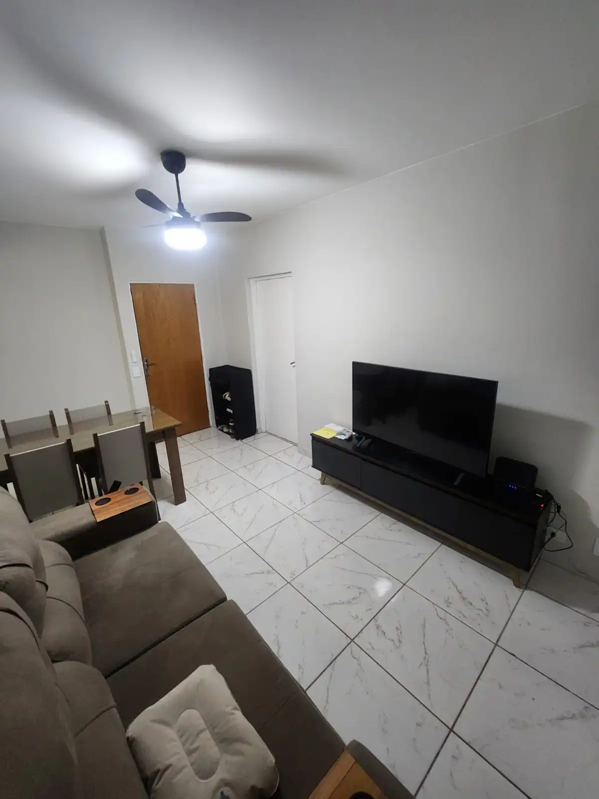

# site-vaga-apartamento-2026

Hotsite estático para divulgação de vaga em apartamento compartilhado na SQN 312, Bloco H, Asa Norte, Brasília.

## Sobre o projeto

Landing page de rolagem, responsiva e leve, criada para ser compartilhada via WhatsApp. Sem backend, sem framework JS — apenas HTML, CSS e JavaScript mínimo.

## Rodar localmente

Abra `index.html` diretamente no navegador, ou use qualquer servidor local simples:

```bash
# Python 3
python3 -m http.server 8000

# Node (npx)
npx serve .
```

Acesse `http://localhost:8000`.

## Estrutura de pastas

```
.
├── index.html          # página principal
├── style.css           # estilos e responsividade
├── script.js           # comportamentos mínimos (nav, scroll)
├── README.md
├── assets/             # imagens do site
│   ├── hero-sala.webp
│   ├── sala-01.webp
│   ├── cozinha-01.webp
│   ├── area-servico-01.webp
│   ├── banheiro-social-01.webp
│   ├── quarto-01.webp
│   ├── quarto-02.webp
│   ├── academia-01.webp
│   └── academia-02.webp
└── docs/               # opcional — documento de regras de convivência
    └── regras-convivencia.pdf
```

## Como trocar as fotos

1. Exporte as fotos em formato `.webp`, com no máximo 300 KB cada.
2. Nomeie os arquivos conforme a lista acima (sem acentos, sem espaços).
3. Coloque-os na pasta `assets/`.
4. No `index.html`, substitua cada `<div class="img-placeholder ...">` pela tag `` correspondente:

```html
<!-- Antes -->
<div class="img-placeholder img-placeholder--hero" aria-label="Foto da sala em breve">
  <span>Foto da sala em breve</span>
</div>

<!-- Depois -->

```

## Cuidados ao fotografar

- Não revelar número do apartamento, correspondências, documentos ou telas.
- Evitar objetos pessoais excessivos, bagunça e rostos de moradores.
- Preferir luz natural e ambientes arrumados.

## Deploy no Cloudflare Pages

1. Suba o repositório no GitHub.
2. No painel do Cloudflare Pages: **Create a project** → conecte o repositório.
3. Configurações:
   - **Framework preset:** None
   - **Build command:** *(vazio)*
   - **Build output directory:** `/`
   - **Branch de produção:** `main`
4. Salve — deploy automático a cada push na `main`.

URL esperada: `https://site-vaga-apartamento-2026.pages.dev`

## Link publicado

*(preencher após o deploy)*
